# Foodie Fix - *Milestone Project 3*

**Find the final project here:**

A back end web application that allows users to browse a directory of recipes as well as add their own recipes.

---

## Table of Contents
1. [Project Overview](#project-overview)
2. [User Experience](#user-experience)
3. [Design Choices](#design-choices)
4. [Project Management](#project-management)
5. [Site Development & Features](#site-development--features)
    * [Universal Site Elements](#universal-site-elements)
    * [Explore Page](#explore-indexhtml)
    * [Inspiration Page](#inspiration-inspirationhtml)
    * [Contact Page](#contact-contacthtml)
6. [Pre-Deployment Testing](#pre-deployment-testing)
    * [Manual vs. Automated Testing](#manual-vs-automated-testing)
    * [Testing During Development](#testing-during-development)
    * [Bug Fixes](#bug-fixes)
    * [Responsiveness](#responsiveness)
    * [Browser Compatibility](#browser-compatibility)
    * [Code Validation](#code-validation)
    * [User Story Testing](#user-story-testing)
    * [Feature Testing](#feature-testing)
7. [Deployment](#deployment)
8. [Post-Deployment Testing](#post-deployment-testing)
    * [Responsiveness](#responsiveness-1)
    * [Browser Compatibility](#browser-compatibility-1)
    * [Lighthouse Testing](#lighthouse-testing)
    * [Future Improvements](#future-improvements)
9. [Credits & Acknowledgements](#credits--acknowledgements)

---

## Project Overview
Foodie Fix is a back end web application intended to help users find cooking inspiration and add their own recipes to a digital cookbook as well as allow other users to view their recipes. The application consits of three main pages: The Home page, which is the recipe directory showing all recipes added to the application from any users; the My Recipes page, which is individual to each user showing them the recipes they have added to the application themselves and; the Account page, where users can view and edit their account details.

---

## User Experience

### Project Goals
The primary goal of the application is to provide a helpful tool where users can browse existing recipes and leave reviews as well as add and edit their own recipes. Foodie Fix has two key target audience:
- People looking for cooking inspiration and new recipes to try.
- People wanting to store their recipes digitally for themselves and others to see.

These target audiences aren't exclusive and some users may want to use Foodie Fix for both purposes.

### Persona One

**User:** Sarah, 36

Sarah is a Data Analyst based in Surrey. Her and her husband have two young children, together they enjoy exploring the outdoors and taking their dog for walks in the woods.

**Sarah's Goals:**
- Find new recipes for family meals.
- Publish her own recipes so they are easy to access in the future.
- Get reviews on her own published recipes.

**How the site helps Sarah:**
- Allows her to find new recipes created by other users.
- Provides her with a digital cookbook where she can publish her own recipes.
- Allows other users to review her published recipes.

### Persona Two

**User:** Oscar, 52

Oscar is a Carpenter based in Newport, he enjoys spending time with his wife and family, albeit fleeting now that his three children are grown up.

**Oscar's Goals:**
- Publish his own recipes for his family and friends to try themselves.
- Find new recipes to try at his next family dinner party.

**How the site helps Oscar:**
- Allows him to publish his own recipes for others to find and try.
- Provides a directory of recipes for him to browse and try.

### Wireframes

**Home Page**

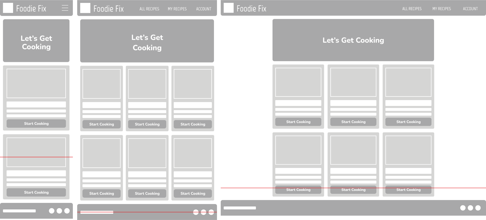

**My Recipes Page**

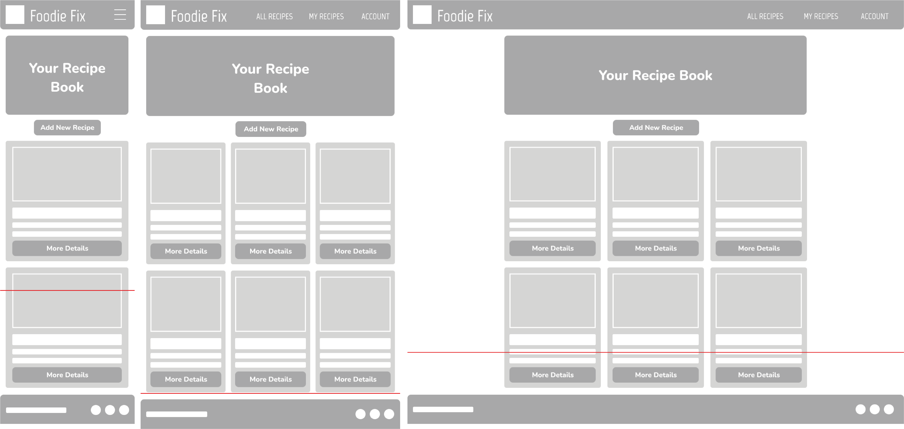

**Account Page**

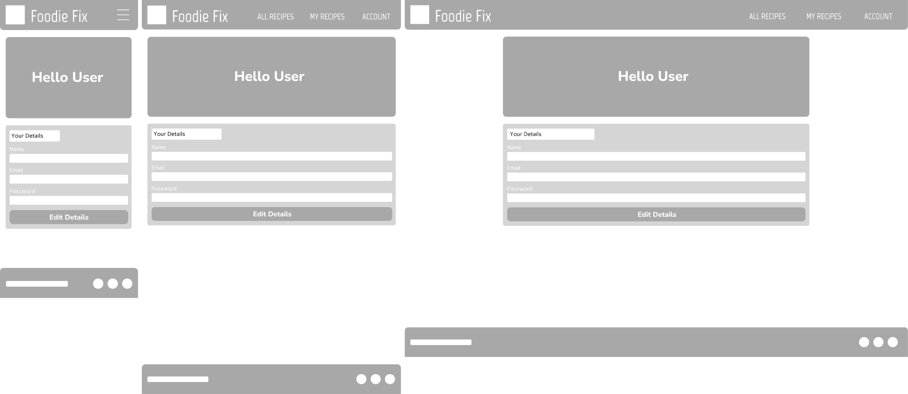

---

## Design Choices

### Colours

From looking at current cooking brands, orange and reds appears to be recurring colours due to their resemblance of food, specifically fruits. I wanted this site to be more vibrant, therefore I used Adobe Colour to test out brighter tones of orange and red until I came the colour scheme shown below.

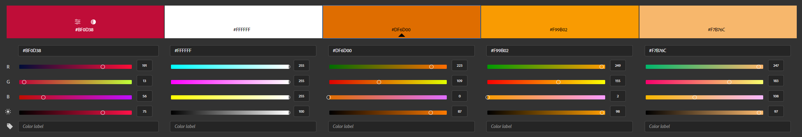

This colour scheme was tested using Adobe's accessibility tools to check the contrast ratio of different colour combinations.

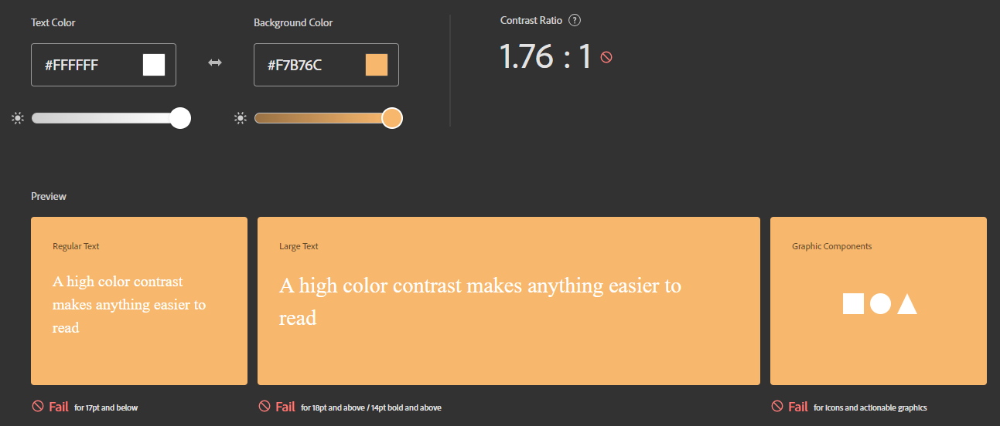

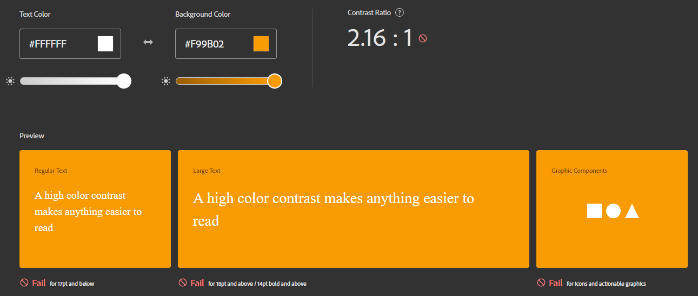

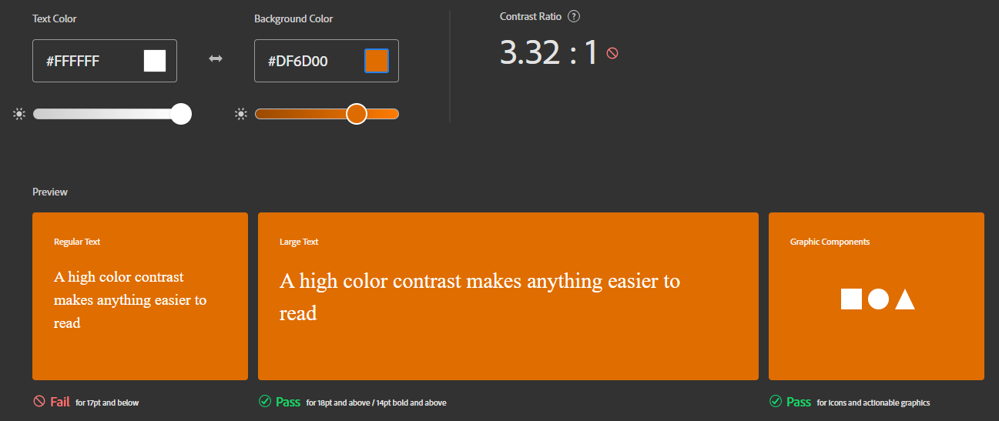

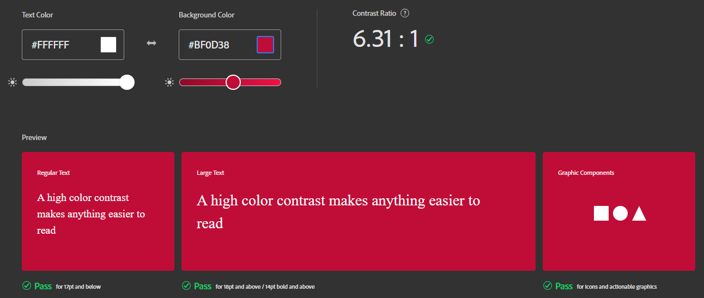

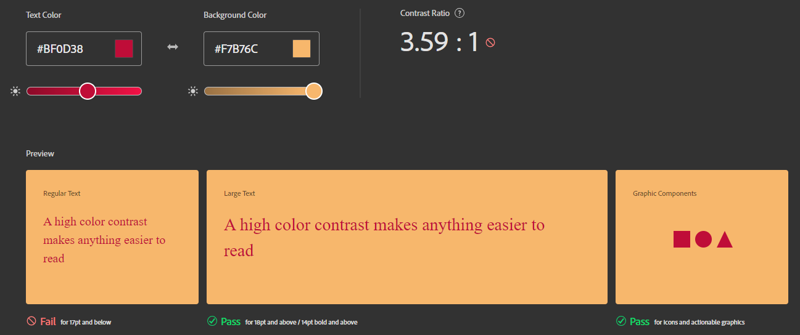

### Typography

### Hi-Fi Wireframes

**Landing Page**

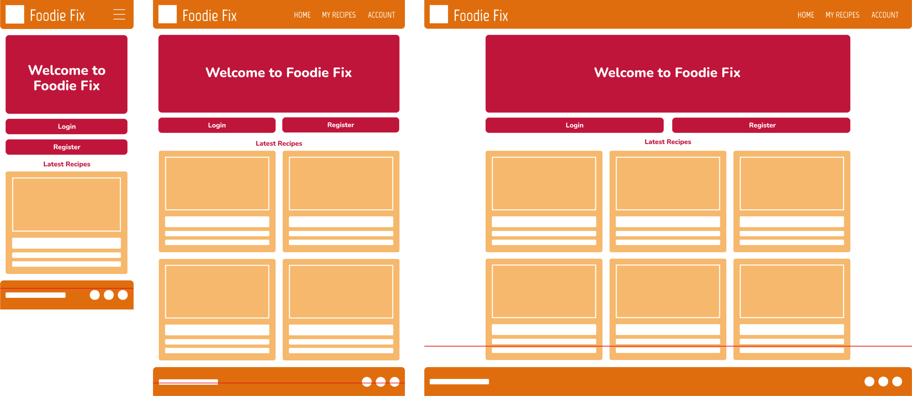

**Home Page**

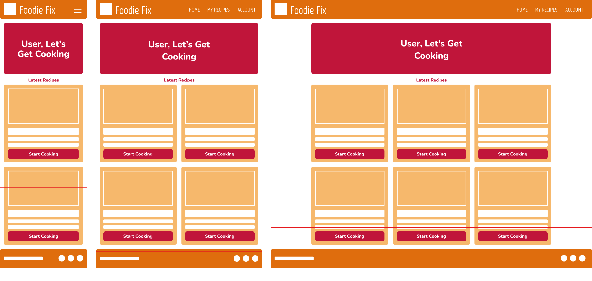

**My Recipes Page**

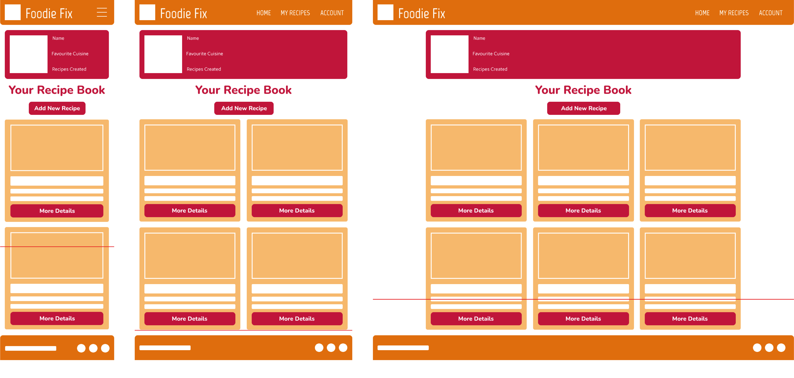

**Recipe Page**

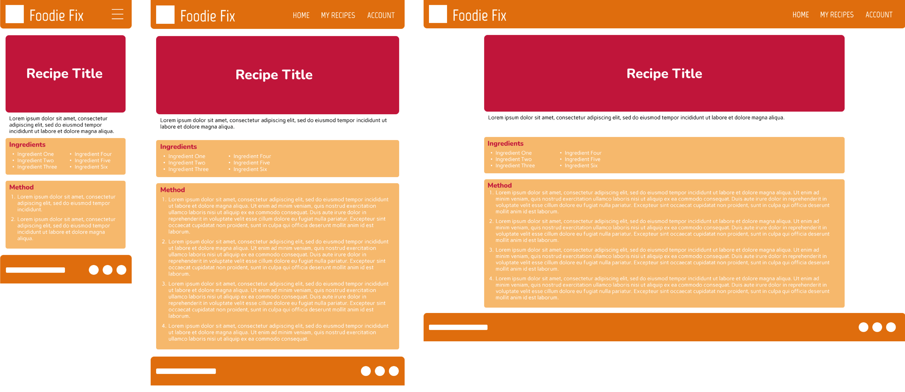

**Account Page**

Aspirational features:
- Filter the main database

---

## Project Management

---

## Site Development & Features

---

## Pre-Deployment Testing

---

## Deployment

---

## Post-Deployment Testing

---

## Credits & Acknowledgement