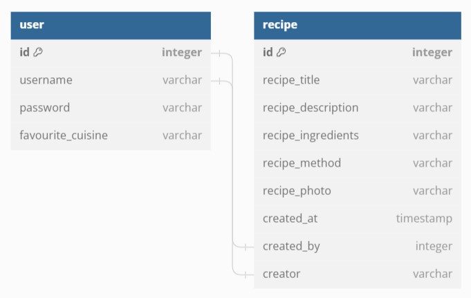
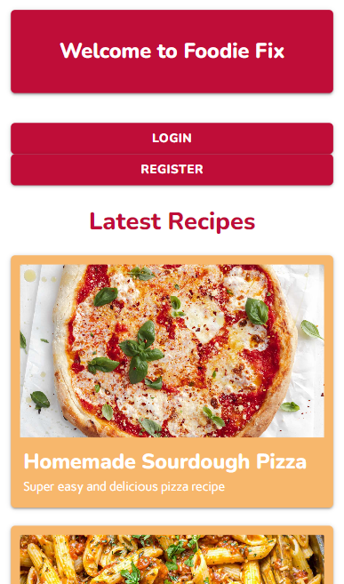

# Foodie Fix - *Milestone Project 3*

**Find the final project here:**

A back end web application that allows users to browse a directory of recipes as well as add their own recipes.

Still to do:
- Mustard colour is not currently used - Should this be implemented?
- Better explanation on forms (tell user to add qty for ingredients and number steps in their method)
- sample env.py

## Table of Contents
1. [Project Overview](#project-overview)
2. [User Experience](#user-experience)
3. [Design Choices](#design-choices)
4. [Database Planning](#database-planning)
5. [Project Management](#project-management)
6. [Site Development & Features](#site-development--features)
    * [Universal Site Elements](#universal-site-elements)
    * [Home Page](#)
    * [My Recipes Page](#)
    * [Recipe Page](#)
    * [Account Page](#)
7. [Pre-Deployment Testing](#)
    * [Manual vs. Automated Testing](#)
    * [Testing During Development](#)
    * [Responsiveness](#)
    * [Browser Compatibility](#)
    * [Bug Fixes](#)
    * [Code Validation](#)
    * [User Story Testing](#)
    * [Feature Testing](#)
8. [Deployment](#)
9. [Post-Deployment Testing](#)
    * [Responsiveness](#)
    * [Browser Compatibility](#)
    * [Lighthouse Testing](#)
    * [Future Improvements](#)
11. [Credits & Acknowledgements](#credits--acknowledgements)

## Project Overview
Foodie Fix is a back end web application intended to help users find cooking inspiration and add their own recipes to a digital cookbook as well as allow other users to view their recipes. The application consits of four main pages: Home, My Recipes, Recipe and Account. The Home page is a recipe directory showing all recipes added to the application, if a user is not logged in they can only view the directory and do not have access to view individual recipe details, however, if a user is logged in they can view the recipe details. The My Recipes page is individual to each user showing them their profile and the recipes they have added to the application. The Recipe pages are where users can read and follow along with a recipe as well as edit or delete a recipe if they are the creator. The Account page is where users can view, edit and delete their account details.

## User Experience

### Project Goals
The primary goal of the application is to provide a helpful tool where users can browse existing recipes as well as add and edit their own recipes. Foodie Fix has two key target audience:
- People looking for cooking inspiration and new recipes to try.
- People wanting to store their recipes digitally for themselves and others to see.

These target audiences aren't exclusive and some users may want to use Foodie Fix for both purposes.

### Persona One

**User:** Sarah, 36

Sarah is a Data Analyst based in Surrey. Her and her husband have two young children, together they enjoy exploring the outdoors and taking their dog for walks in the woods.

**Sarah's Goals:**
- Find new recipes for family meals.
- Publish her own recipes so they are easy to access in the future.

**How the site helps Sarah:**
- Allows her to find new recipes created by other users.
- Provides her with a digital cookbook where she can publish her own recipes.

### Persona Two

**User:** Oscar, 52

Oscar is a Carpenter based in Newport, he enjoys spending time with his wife and family, albeit fleeting now that his three children are grown up.

**Oscar's Goals:**
- Publish his own recipes for his family and friends to try themselves.
- Find new recipes to try at his next family dinner party.

**How the site helps Oscar:**
- Allows him to publish his own recipes for others to find and try.
- Provides a directory of recipes for him to browse and try.

### Wireframes

Below are the first wireframes for the site, initially, the site consisted of just three pages, a main recipe directory page, the page for users to view their own recipes and an account page where users can review their details.

Following testing of these wireframes to understand how a user would navigate the site it was found that more pages were needed to ensure the purpose of the site was fully conveyed to users and it wa easy for users to follow.

**Home Page**

**My Recipes Page**

**Account Page**

## Design Choices

### Colours

From looking at current cooking brands, orange and reds appears to be recurring colours due to their resemblance of food, specifically fruits. I wanted this site to be more vibrant, therefore I used Adobe Colour to test out brighter tones of orange and red until I came the colour scheme shown below.

This colour scheme was tested using Adobe's accessibility tools to check the contrast ratio of different colour combinations.

White was tested on all four coloured background to see if it would be a suitable text colour throughout the site. It was found that white text only worked on the deep orange and fuscia. The deep fuscia was tested on the pale yellow and would work as a suitable text colour.

Here are the final colour assignments that were later implemented into the wireframes:
- Deep Fuscia #BF0D38 - Button Background & Header Text
- White #FFFFFF - Text (only on Deep Fuscia & Deep Orange)
- Deep Orange #DF6D00 - Header & Footer Background
- Mustard #F99B02 - Hovers & Clicked Links
- Pale Yellow #F7B76C - Card Backgrounds
- Black #000000 - Text (only when white or deep fuscia caanot be used)

### Typography

The chosen fonts for this application are Google Fonts: Marvel, Nunito & Carme.

Marvel will be used for the navbar and logo, only in uppercase.

Nunito will be used for headers and buttons.

Carme will be used for paragraph text.

### Hi-Fi Wireframes

The initial wireframes were developed upon to ensure the purpose of the site was fully conveyed to the users. Some additions were also made to aid in planning the site and figuring out the journey a user would take through the site, these included the landing page allowing users to register or login as well as an individual recipe page.

**Home Page**

The home page consists of a main header title followed by options for the user to register or login. Below this is a grid of a the latest recipes added to the site, however the user currently cannot see more details about the recipe because they are not logged in.

Upon logging in, the home page is altered and consists of a header title followed by the same grid of latest recipes, however this time the button allowing the user to view the recipe is now present.

**My Recipes Page**

The my recipes page is where the user can view their profile, add recipes to the site and view the recipes they have already added to the site.

**Recipe Page**

The recipe page is where a user is directed upon clicking for more details on a recipe. If they created the recipe there will also be an edit and delete button at the bottom of the recipe page. If they did not create the recipe, then this button will not be present and they can only view the recipe.

**Account Page**

The account page shows the users details that they would've filled out upon registering. Underneath is the option for the user to edit or delete their details.

Here is a list of aspirational features that would be nice to include in the application, however not necessary and will only be implemented if time allows:
- Filter the main database of recipes by cuisine or meal.
- Allow users to review other recipes.
- Show the total number of recipes as user has created on their profile.
- Allow other users to navigate to a creators profile.
- A site specific 404 page to keep the users on the site even in the event of an error.

## Database Planning

SQL will be used in this project to create a relational database system containing the details needed for the application. One of the drawbacks of SQL is that once a database has been created and the fields have been filled with data, it is quite frustrating to edit or add new fields. Therefore, before creating any database functionality, the tables that would be needed for this project were planned out to hopefully prevent a frustrating and time-consuming update later on in the project.

Below is a visualisation of the tables needed for the minimum viable application, this consists of a user table where users information from registration will be stored, and a recipe table where all the information relating to recipes will be stored. Each table has a primary key of id and the foreign keys between the two tables is the user.id which is added to the recipe.created_by and the user.username which is added to the recipe.creator.

If throughout the project there is time to include any of the aspirational features mentioned in [Hi-Fi Wireframes](#hi-fi-wireframes), this is the visualisation showing the tables that will be needed. The recipe table has now got cuisine and meal fields so the database can be filtered based on those fields, and the review table has been added. All three tables have their own primary key of id, the foreign keys between user and recipe table has remained the same however the user.name is also the foreign key used in the review table and to link the recipe and review tables, the recipe.id becomes the foreign key.

## Project Management

### Languages Used
- HTML5
- CSS3
- JavaScript
- Python

### Version Control
During the development of the application, GitHub was used to manage versions of each file. Commits were made often and consisted of one feature implementation or edit at a time so it would be easier to roll back to a previous version if required. Compared to milestone projects one and two there were even fewer commits due to a lot of the HTML and CSS being boilerplate code from previous personal projects as well as walkthrough projects from the Code Insitute course content. Similar to milestone project two, I was more diligant with the commits being made since Python was also a steep learning curve, meaning I could rollback a feature that wasn't working without it impacting any other features. Throughout the development of the project, I had to roll back my code once whilst trying to get Flask-Login user authetnication working as this was a feature that wasn't covered in the course content, therefore I was relying on external resources meaning some elements of code were missed whilst I was learning this new feature. In total, there were ... commits for this project. Details of the commits can be found here:

## Site Development & Features

### External Links Used Across Site
Materialize CSS framework was used throughout the site to aid in developing a responsive, well-laid out site. This framework allowed the main structure of the site to be developed quickly and copied across pages, therefore time could be well-spent focussing on the functionality of the SQL database and linking the data to the front-end.

The responsiveness of the site was setup using materialize column classes referring to small, medium and large screens. On small screens most content fills the whole screen therefore the s12 class was used. On medium screens the m6 class was used to split content into two columns. On large screens a mixture of l6 and l4 was used to split content into either two or three columns where appropriate.

Font Awesome icons were used in the site forms and for the links in the footer.

Three Google fonts were used throughout the site: Marvel, Nunito and Carme. Details on the choice of these fonts can be found in the [Typography](#typography) section above.

### Base.html
Jinja templating was used throughout the site, each page of the site extends from the base.html file which lays out the navbar and footer.

The navbar consists of the site name and page links. If the user is authenticated all four links appear on the navbar, however if the user is not authenticated only the home link is visible.

The authenticated navbar on large screen.

The not authenticated navbar on large screen.

The authenticated navbar on small screen.

The mobile sidenav.

The footer consists of copyright information on the left and three social links on the right.

The footer on large screen.

The footer on small screen.

### Home Page
The home page showcases all recipes on the application in a grid format. Similar to the navbar, this page will look different depending on whether a user is authenticated or not. If a user is not authenticated, for example when they first access the site, they see a welcome title followed by two buttons encouraging them to either register or login. Beneath this is the grid of recipes.

Home page on large screen when not authenticated.

Home page on small screen when not authenticated.

If a user is authenticated instead of the welcome title they see their username followed by 'Let's get cooking' and the login and register buttons are no longer visible. Also, on the recipe cards a button is now visible encouraging the user to click to see more details about the recipe.

Home page on large screen when authenticated.

Home page on small screen when authenticated.

### Login & Register
The login and registration forms are simple materialize forms that have been customised to fit the application.

The login form asks users to enter their username and password. At the bottom is a link to the register page if they are not already registered.

Login form on large screen.

Login form on small screen.

The registration form asks users to enter a username, password and their favourite cuisine. Similar to the login form, there is a link at the bottom for users to login if they are already registered.

Registration form on large screen.

Registration form on small screen.

### My Recipes Page
The my recipes page shows the current user their account details at the top followed by a grid of their recipes that they have added to the site with a button to add more recipes.

My recipes page on large screen.

My recipes page on small screen.

### Add & Edit Recipe
The add and edit recipe pages are simple materialize forms that have been customised to fit the site.

The add recipe form consists of a title, description, ingredients, method and photo. All fields are strings and the photo must be a URL, there is URL validation within the add recipe route to ensure the URL is valid before posting the data to the database.

Add recipe form on large screen.

Add recipe form on small screen.

The edit recipe form consists of the same fields as the add recipe form however these fields are pre-filled with the current values.

Edit recipe form on large screen.

Edit recipe form on small screen.

### Recipe Page
- Edit/ delete moved under header - Felt more fitting and would actually be seen
- Image & header in same row on larger screens - Image was very large and took up unecessary amount of space, also the original layout was very simple and boring.

Recipe page on large screen.

Recipe page on small screen.

### Account Page
- Profile photo removed - Seemed unecessary

Account page on large screen.

Account page on small screen.

### Edit Account

Edit account form on large screen.

Edit account form on small screen.

### Delete Modals

Delete recipe modal on large screen.

Delete recipe modal on small screen.

Delete account modal on large screen.

Delete account modal on small screen.

## Pre-Deployment Testing

### Testing During Development
- Flask-login setup
- Code snippets from login testing

### Responsiveness
Screen Width | | | | | Device | | | | |
---: | :---: | :---: | :---: | :---: | :---: | :---: | :---: | :---: | :---:
| | Galaxy S9+ (320px) | iPhone 6/7/8 (375px) | iPhone XR (414px) | iPad Mini (768px) | iPad Air (820px) | Surface Pro 7 (912px) | iPad Pro (1024px) | Desktop (1201px) | Desktop (2000px)
<= 576px | Good | Good | Good | NA | NA | NA | NA | NA | NA
576px < >= 992px | NA | NA | NA | Good | Good | Good | NA | NA | NA
992px < | NA | NA | NA | NA | NA | NA | Good | Good | Good
Links/ URLs work | Yes | Yes | Yes | Yes | Yes | Yes | Yes | Yes | Yes
Images work | Yes | Yes | Yes | Yes | Yes | Yes | Yes | Yes | Yes
Renders as expected | Yes | Yes | Yes | Yes | Yes | Yes | Yes | Yes | Yes

- Delete modal on mobile needs bottom padding
- Truncate text on recipe cards

### Browser Compatibility

| | Browser | | | Notes
:--- | :--- | --- | --- | ---
| | Chrome | Edge | Firefox
Intended Appearance? | Yes | Yes | Yes | Site appears as expected on all browsers tested
Intended Responsiveness? | Yes | Yes | Yes | Site responds as expected on all browsers tested
Forms Work as Expected? | Yes | Yes | Yes | All forms function as expected in all browsers tested

### Bug Fixes

**Bug One:** The generic_recipe.jpg was not visible on the individual recipe pages. After reviewing the image link shown in Chrome Developer Tools, I found the issue was that 'view_recipe' was being added to the start of the image path from the view_recipe route. Therefore, to resolve this, I made the image source in the code an absolute filepath by putting '../' at the beginning, meaning the individual recipe pages can correctly locate the image from within the file structure.

**Bug Two:** Recipe cards with longer titles or descriptions were rendering taller on the home and my recipes pages than the other recipe cards, meaning the grid layout had a gap under the taller cards since the next card couldn't sit directly beneath it. To resolve this I used the Jinja truncate feature to cut the length of the recipe title and description so the cards will always display at the same height.

**Bug Three:**
- Edit/Delete & Login/Register buttons no padding

- More details button colours

**Bug Four:**
- Padding on delete modal on mobile

**Bug Five:**
- Footer links lower than copyright info

### Code Validation

### User Story Testing

User Story | Testing
--- | ---
As a user | 
As a user | 
As a user | 
As a user | 
As a user | 

### Feature Testing

Feature | Action | Effect
--- | --- | ---
Logo (all pages) | Hover over | Cursor changes to a pointer, colour changes to #7FFF30
| | Click | Direct users to index.html
Site Navigation (<768px wide) (all pages) | Hover over toggler | Cursor changes to a pointer, colour changes to #7FFF30
| | Click toggler | Opens dropdown navigation menu
| | Hover over page | Cursor changes to a pointer, colour changes to #7FFF30
| | Click page | Directs user to selected page
Site Navigation (>=768px wide) (all pages) | Hover over page | Cursor changes to a pointer, colour changes to #7FFF30
| | Click page | Directs user to selected page
Place Type Criteria | Hover over | Bug: A hover needs adding to this feature to provide suitable feedback to the user
| | Click | Opens a dropdown selection of place types
| | Hover over | Highlights the place type
| | Click | Selects the place type
Submit Place Type | Hover over | Cursor changes to a pointer, colour changes to #7FFF30
| | Click | Shows nearby places of that type on the map below
Map (index.html, oxford.html, bath.html & falmouth.html) | Click & Drag | Pan around the map
| | Ctrl & Scroll | Zoom in or out of the map
Map Markers (index.html, oxford.html, bath.html & falmouth.html) | Click | An info-window appears above the marker and a place card is opened beneath the map
Place Card | Hover over link | Cursor changes to a pointer, colour changes to #7FFF30
| | Click | Directs user to external webpage for that place. Bug: This doesn't open in a new tab
Footer Links (all pages) | Hover over | Cursor changes to a pointer, colour changes to #7FFF30
| | Click | Opens selected social page in a new tab
Inspiration Card Button | Hover over | Cursor changes to a pointer, colour changes to #7FFF30
| | Click | Directs user to selected adventure guide
Contact Form | Hover over data fields | Cursor changes to a text cursor, border colour changes to #7FFF30
| | Click in data field | Border changes to black, typing cursor appears in data field
| | Hover over 'SUBMIT' | Cursor changes to a pointer, colour changes to #7FFF30
| | Click 'SUBMIT' | If data fields filled in correctly: Directs user to thank you page. If data fields not filled in correctly: Alerts user which field is missing or has incorrect data

## Deployment
- Set description to min 40 characters

### Database Creation with Elephant SQL

### Site Deployment to Heroku

### Linking ESQL Database to Heroku App

### Deployed Database Setup

## Post-Deployment Testing

### Responsiveness
Screen Width | | | | | Device | | | | |
---: | :---: | :---: | :---: | :---: | :---: | :---: | :---: | :---: | :---:
| | Galaxy S9+ (320px) | iPhone 6/7/8 (375px) | iPhone XR (414px) | iPad Mini (768px) | iPad Air (820px) | Surface Pro 7 (912px) | iPad Pro (1024px) | Desktop (1201px) | Desktop (2000px)
<= 576px |  |  |  | NA | NA | NA | NA | NA | NA
576px < >= 992px | NA | NA | NA |  |  |  | NA | NA | NA
992px < | NA | NA | NA | NA | NA | NA |  |  | 
Links/ URLs work | Yes | Yes | Yes | Yes | Yes | Yes | Yes | Yes | Yes
Images work | Yes | Yes | Yes | Yes | Yes | Yes | Yes | Yes | Yes
Renders as expected |  |  |  |  |  |  |  |  | 

### Browser Compatibility
| | Browser | | | Notes
:--- | :--- | --- | --- | ---
| | Chrome | Edge | Firefox
Intended Appearance? |  |  |  | Site appears as expected on all browsers tested
Intended Responsiveness? |  |  |  | Site responds as expected on all browsers tested

### Lighthouse Testing

### Future Improvements

## Credits & Acknowledgement
