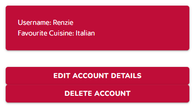
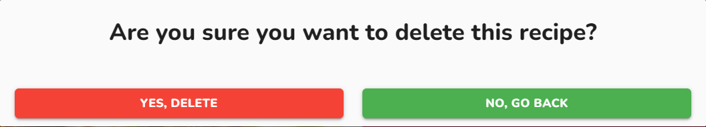

# Foodie Fix - *Milestone Project 3*

**Find the final project here:** https://foodie-fix-renz2299-8753868d09c0.herokuapp.com/

A back end web application that allows users to browse a directory of recipes as well as add their own recipes.

## Table of Contents
1. [Project Overview](#project-overview)
2. [User Experience](#user-experience)
3. [Design Choices](#design-choices)
4. [Database Planning](#database-planning)
5. [Project Management](#project-management)
6. [Site Development & Features](#site-development--features)
    * [Universal Site Elements](#universal-site-elements)
    * [Base.html](#basehtml)
    * [Home Page](#home-page)
    * [Login & Register](#login--register)
    * [My Recipes Page](#my-recipes-page)
    * [Add & Edit Recipe](#add--edit-recipe)
    * [Recipe Page](#recipe-page)
    * [Account Page](#account-page)
    * [Edit Account](#edit-account)
    * [Delete Modals](#delete-modals)
7. [Pre-Deployment Testing](#pre-deployment-testing)
    * [Testing During Development](#testing-during-development)
    * [Responsiveness](#responsiveness)
    * [Browser Compatibility](#browser-compatibility)
    * [Bug Fixes](#bug-fixes)
    * [Code Validation](#code-validation)
    * [User Story Testing](#user-story-testing)
    * [Feature Testing](#feature-testing)
8. [Deployment](#deployment)
9. [Post-Deployment Testing](#post-deployment-testing)
    * [Responsiveness](#responsiveness-1)
    * [Browser Compatibility](#browser-compatibility-1)
    * [Lighthouse Testing](#lighthouse-testing)
    * [Future Improvements](#future-improvements)
10. [Credits & Acknowledgements](#credits--acknowledgements)

## Project Overview
Foodie Fix is a back end web application intended to help users find cooking inspiration and add their own recipes to a digital cookbook as well as allow other users to view their recipes. The application consists of four main pages: Home, My Recipes, Recipe and Account. The Home page is a recipe directory showing all recipes added to the application, if a user is not logged in they can only view the directory and do not have access to view individual recipe details, however, if a user is logged in they can view the recipe details. The My Recipes page is individual to each user showing them their profile and the recipes they have added to the application. The Recipe pages are where users can read and follow along with a recipe as well as edit or delete a recipe if they are the creator. The Account page is where users can view, edit and delete their account details.

## User Experience

### Project Goals
The primary goal of the application is to provide a helpful tool where users can browse existing recipes as well as add and edit their own recipes. Foodie Fix has two key target audience:
- People looking for cooking inspiration and new recipes to try.
- People wanting to store their recipes digitally for themselves and others to see.

These target audiences aren't exclusive and some users may want to use Foodie Fix for both purposes.

### Persona One

**User:** Sarah, 36

Sarah is a Data Analyst based in Surrey. Her and her husband have two young children, together they enjoy exploring the outdoors and taking their dog for walks in the woods.

**Sarah's Goals:**
- Find new recipes for family meals.
- Publish her own recipes so they are easy to access in the future.

**How the site helps Sarah:**
- Allows her to find new recipes created by other users.
- Provides her with a digital cookbook where she can publish her own recipes.

### Persona Two

**User:** Oscar, 52

Oscar is a Carpenter based in Newport, he enjoys spending time with his wife and family, albeit fleeting now that his three children are grown up.

**Oscar's Goals:**
- Publish his own recipes for his family and friends to try themselves.
- Find new recipes to try at his next family dinner party.

**How the site helps Oscar:**
- Allows him to publish his own recipes for others to find and try.
- Provides a directory of recipes for him to browse and try.

### Wireframes

Below are the first wireframes for the site, initially, the site consisted of just three pages, a main recipe directory page, the page for users to view their own recipes and an account page where users can review their details.

Following testing of these wireframes to understand how a user would navigate the site it was found that more pages were needed to ensure the purpose of the site was fully conveyed to users and it wa easy for users to follow.

**Home Page**

**My Recipes Page**

**Account Page**

## Design Choices

### Colours

From looking at current cooking brands, orange and reds appears to be recurring colours due to their resemblance of food, specifically fruits. I wanted this site to be more vibrant, therefore I used Adobe Colour to test out brighter tones of orange and red until I came the colour scheme shown below.

This colour scheme was tested using Adobe's accessibility tools to check the contrast ratio of different colour combinations.

White was tested on all three coloured backgrounds to see if it would be a suitable text colour throughout the site. It was found that white text only worked on the deep orange and fuscia. The deep fuscia was tested on the pale yellow and would work as a suitable text colour.

Here are the final colour assignments that were later implemented into the wireframes:
- Deep Fuscia #BF0D38 - Button Background & Header Text
- White #FFFFFF - Text (only on Deep Fuscia & Deep Orange)
- Deep Orange #DF6D00 - Header & Footer Background, Button Hover Colour
- Pale Yellow #F7B76C - Card Backgrounds
- Black #000000 - Text (only when white or deep fuscia caanot be used)

### Typography

The chosen fonts for this application are Google Fonts: Marvel, Nunito & Carme.

Marvel will be used for the navbar and logo, only in uppercase.

Nunito will be used for headers and buttons.

Carme will be used for paragraph text.

### Hi-Fi Wireframes

The initial wireframes were developed upon to ensure the purpose of the site was fully conveyed to the users. Some additions were also made to aid in planning the site and figuring out the journey a user would take through the site, these included the landing page allowing users to register or login as well as an individual recipe page.

**Home Page**

The home page consists of a main header title followed by options for the user to register or login. Below this is a grid of a the latest recipes added to the site, however the user currently cannot see more details about the recipe because they are not authenticated.

Upon logging in, the home page is altered and consists of a header title followed by the same grid of latest recipes, however this time the button allowing the user to view the recipe is now present.

**My Recipes Page**

The my recipes page is where the user can view their profile, add recipes to the site and view the recipes they have already added to the site.

**Recipe Page**

The recipe page is where a user is directed upon clicking for more details on a recipe. If they created the recipe there will also be an edit and delete button at the bottom of the recipe page. If they did not create the recipe, then this button will not be present and they can only view the recipe.

**Account Page**

The account page shows the user's details that they would've filled out upon registering. Underneath is the option for the user to edit or delete their details.

Here is a list of aspirational features that would be nice to include in the application, however not necessary and will only be implemented if time allows:
- Filter the main database of recipes by cuisine or meal.
- Allow users to review other recipes.
- Show the total number of recipes a user has created on their profile.
- Allow other users to navigate to a creators profile.
- A site specific 404 page to keep the users on the site even in the event of an error.

## Database Planning

SQL will be used in this project to create a relational database system containing the details needed for the application. One of the drawbacks of SQL is that once a database has been created and the fields have been filled with data, it is quite frustrating to edit or add new fields. Therefore, before creating any database functionality, the tables that would be needed for this project were planned out to hopefully prevent a frustrating and time-consuming update later on in the project.

Below is a visualisation of the tables needed for the minimum viable application, this consists of a user table where users information from registration will be stored, and a recipe table where all the information relating to recipes will be stored. Each table has a primary key of id and the foreign keys between the two tables is the user.id which is added to the recipe.created_by and the user.username which is added to the recipe.creator.

If throughout the project there is time to include any of the aspirational features mentioned in [Hi-Fi Wireframes](#hi-fi-wireframes), this is the visualisation showing the tables that will be needed. The recipe table has now got cuisine and meal fields so the database can be filtered based on those fields, and the review table has been added. All three tables have their own primary key of id, the foreign keys between user and recipe table has remained the same however the user.name is also the foreign key used in the review table and to link the recipe and review tables, the recipe.id becomes the foreign key.

## Project Management

### Languages Used
- HTML5
- CSS3
- JavaScript
- Python

### Version Control
During the development of the application, GitHub was used to manage versions of each file. Commits were made often and consisted of one feature implementation or edit so it would be easier to roll back to a previous version if required. Similar to milestone project two, I was more diligant with the commits being made since Python was also a steep learning curve, meaning I could rollback a feature that wasn't working without it impacting any other features. Throughout the development of the project, I had to roll back my code once whilst trying to get Flask-Login user authetnication working as this was a feature that wasn't covered in the course content, therefore I was relying on external resources meaning some elements of code were missed whilst I was learning this new feature. In total, there were 48 commits for this project. Details of the commits can be found here: https://github.com/Renz2299/foodie-fix/commits/main

## Site Development & Features

### External Links Used Across Site
Materialize CSS framework was used throughout the site to aid in developing a responsive, well-laid out site. This framework allowed the main structure of the site to be developed quickly and copied across pages, therefore time could be well-spent focussing on the functionality of the SQL database and linking the data to the front-end.

The responsiveness of the site was setup using materialize column classes referring to small, medium and large screens. On small screens most content fills the whole screen therefore the s12 class was used. On medium screens the m6 class was used to split content into two columns. On large screens a mixture of l6 and l4 was used to split content into either two or three columns depending on the feature.

Font Awesome icons were used in the site forms and for the links in the footer.

Three Google fonts were used throughout the site: Marvel, Nunito and Carme. Details on the choice of these fonts can be found in the [Typography](#typography) section above.

### Base.html
Jinja templating was used throughout the site, each page of the site extends from the base.html file which lays out the navbar and footer.

The navbar consists of the site name and page links. If the user is authenticated all four links appear on the navbar, however, if the user is not authenticated only the home link is visible. This was done using  to determine what content should be visible.

The authenticated navbar.

The not authenticated navbar.

The mobile sidenav.

The footer consists of copyright information on the left and three social links on the right.

### Home Page
The home page showcases all recipes on the application in a grid format. Similar to the navbar, this page will look different depending on whether a user is authenticated or not. If a user is not authenticated, they see a welcome title followed by two buttons encouraging them to either login or register. Beneath this is the grid of recipes, where if the user is not authenticated, they can only see the recipe photo, title and description and cannot navigate to the recipe to view more details.

Home page when not authenticated.

If a user is authenticated instead of the welcome title they see their username followed by 'Let's get cooking' and the login and register buttons are no longer visible. Also, on the recipe cards a button is now visible encouraging the user to click to see more details about the recipe.

Home page when authenticated.

Jinja was used to retrieve the appropriate details from the user and recipe table and show it on the front-end. For example,  was used in the header of the authenticated home page and,  was used to show each recipe title within the cards of the grid layout.

### Login & Register
The login and registration forms are simple materialize forms that have been customised to fit the application.

The login form asks users to enter their username and password. At the bottom is a link to the register page in case they are not already registered.

The registration form asks users to enter a username, password and their favourite cuisine. Similar to the login form, there is a link at the bottom for users to login if they are already registered.

### My Recipes Page
The my recipes page shows the current user their account details at the top followed by a grid of their recipes that they have added to the site with a button to add more recipes.

Jinja was also used on this page to retrieve the appropriate details from the user and recipe table.

### Add & Edit Recipe
The add and edit recipe pages are simple materialize forms that have been customised to fit the site.

The add recipe form consists of a title, description, ingredients, method and photo. All fields are strings and the photo must be a URL. Urllib was used to validate the URL before posting the data to the database.

The edit recipe form consists of the same fields as the add recipe form however these fields are pre-filled with the current values.

### Recipe Page
The recipe page shows the user an individual recipe. The layout of this page has changed slightly from the wireframes as during development the edit and delete buttons were quite hidden at the bottom of the page, therefore they were moved to beneath the image and initial recipe information. Also, the image took up a lot of space on large screens, therefore the image and initial recipe information were moved into the same row on large screens.

Jinja was used on this page to retrieve all recipe information, including the date it was created and the user that created it.

### Account Page
The account page is very simple, showing the current user their username and favourite cuisine along with an edit and delete button so they can make changes to their account. The original wireframes for this page also included a profile photo, however during development this seemed unecessary and therefore was removed from the user table.

Jinja was used on this page to retrieve the username and favourite cuisine of the current_user.

### Edit Account
The edit account form is a simple materialize form consisting of two fields: username and favourite cuisine. These fields are pre-filled with the current values so the user can easily edit them if they desire.

### Delete Modals
There are two modals within this app, both used for when the user would like to delete something so they can confirm their choice before any data is deleted from the database.

## Pre-Deployment Testing

### Testing During Development
Testing was carried out during development to check features were working as expected and to identify issues immediately so they could be rectified. This was done using GitPod's port feature allowing previews to be opened in a new browser tab.

The database functionality was tested each time a new update was implemented to ensure it was setup and functioning correctly. This also meant if something didn't work as planned the code casuing the problem could be found easily.

The main issue during development was setting up the user authentication functionality as that was needed to drive what the user could see on each page and prevent certain users being able to edit or delete data they did not create. This was an issue because it was not covered in the Code Institute course content, therefore external resources had to be used to learn how to implement user authentication.

Flask-Login was used to authenticate users. It took some time to get this up and running and a lot of trial and error to figure out what code was causing the errors being received.

The six commits made between 7th & 9th November show the experimentation that was done during development to get Flask-Login working correctly and allowing users to be authenticated.

The main piece of code that was necessary for this was to correctly assign the recipe.created_by and recipe.creator upon creation of a new recipe as this then allows the database to be queried correctly when a user navigates to their My Recipes page or an individal recipe page to determine what they have access to on the page.

This is the initalisation code that was added to the recipe table within the models.py file:

A lot was learnt from this issue, including how to correctly implement flask-login within and also that user authentication should be setup prior to any other tables as the data within the recipe table relied on information being present in the user table.

### Responsiveness
The site was tested on a multitude of screen sizes using Chrome developer tools to check that the site renders correctly on all screens tested and that all images and links work properly.

Screen Width | | | | | Device | | | | |
---: | :---: | :---: | :---: | :---: | :---: | :---: | :---: | :---: | :---:
| | Galaxy S9+ (320px) | iPhone 6/7/8 (375px) | iPhone XR (414px) | iPad Mini (768px) | iPad Air (820px) | Surface Pro 7 (912px) | iPad Pro (1024px) | Desktop (1201px) | Desktop (2000px)
<= 576px | Good | Good | Good | NA | NA | NA | NA | NA | NA
576px < >= 992px | NA | NA | NA | Good | Good | Good | NA | NA | NA
992px < | NA | NA | NA | NA | NA | NA | Good | Good | Good
Links/ URLs work | Yes | Yes | Yes | Yes | Yes | Yes | Yes | Yes | Yes
Images work | Yes | Yes | Yes | Yes | Yes | Yes | Yes | Yes | Yes
Renders as expected | Yes | Yes | Yes | Yes | Yes | Yes | Yes | Yes | Yes

The site rendered and functioned correctly on all screen sizes tested. The only bug found was that recipes with a longer title or description sometimes got pushed onto a second or third line, meaning the cards came out of alignment and left excess white space underneath.

This bug was resolved and the solution can be found in the [Bug Fixes](#bug-fixes) section.

### Browser Compatibility
The site was tested in multiple browsers to ensure all features worked correctly and the site responded in the intended way no matter what browser was being used.

| | Browser | | | Notes
:--- | :--- | --- | --- | ---
| | Chrome | Edge | Firefox
Intended Appearance? | Yes | Yes | Yes | Site appears as expected on all browsers tested
Intended Responsiveness? | Yes | Yes | Yes | Site responds as expected on all browsers tested
Forms Work as Expected? | Yes | Yes | Yes | All forms function as expected in all browsers tested

The result of this testing was very positive, the site rendered and functioned correctly on all browsers tested.

### Bug Fixes

**Bug One:** The generic_recipe.jpg was not visible on the individual recipe pages. After reviewing the image link shown in Chrome Developer Tools, the issue was that 'view_recipe' was being added to the start of the image path from the view_recipe route. Therefore, to resolve this, the image source in the code was changed to an absolute filepath by putting '../' at the beginning, meaning the individual recipe pages can correctly locate the image from within the file structure.

**Bug Two:** Recipe cards with longer titles or descriptions were rendering taller on the home and my recipes pages than the other recipe cards, meaning the grid layout had a gap under the taller cards since the next card couldn't sit directly beneath it. To resolve this, the Jinja truncate feature was used to cut the length of the recipe title and description so the cards will always display at the same height.

**Bug Three:** Wherever two buttons were used together on the site, if the site was being accessed on a mobile screen the second button had no margin above it therefore the button was rendering directly beneath the first button. This was a simple fix and required a media query in the styles.css file setting the top margin of buttons to 10px when viewed in one column, which in materialize was once the screen width reached 600px or lower.

### Code Validation
The HTML, CSS, JavaScript and Python for the site was ran through a validator specific to each language, the results are shown in the table below.

| | Validations | Notes
---: | --- | ---
HTML | Checked on: https://validator.w3.org/ | **Errors:** Missing favicon. Images don't have alt attributes. **Warnings:** Sections don't have headers. P element not allowed as child of button element in this context.
CSS | Checked on: https://jigsaw.w3.org/css-validator/ | No errors or warnings found.
JavaScript | Checked on: https://jshint.com/ | **Errors:** No errors. **Warnings:** 'let' is available in ES6.
Python | Checked on: https://pep8ci.herokuapp.com/ | **Errors:** No errors.  **Warnings:** Lines shouldn't be longer than 79 characters. Under/ Over indentation.

The above errors were resolved and committed to GitHub in a single commit. In the HTML code, a favicon was added to base.html and any pages where a p tag was used within a button that directly posted data to the database was removed. In the python code any lines over 79 characters were shortened using a '\' to move code to the line beneath.

### User Story Testing
To ensure the site met the original user goal's outlined in the [User Experience](#user-experience) section, each goal was tested to check that it was met by the finished site.

User Story | Testing
--- | ---
As a user I want to find new recipes for family meals. | On the Home page browse the directory of recipes, if you'd like to view more details, first make sure you are logged in and then click the More Details button.
As a user I want to publish my own recipes so they are easy to access in the future. | Once logged in, on the My Recipes page click the Add Recipe button and input the details of the recipe you'd like to add. Return to the My Recipes page whenever you'd like to browse your own recipes that you have added to the site.
As a user I want my published recipes to be accessible to my friends and family. | Once you have published a recipe inform your friends and family or share the URL with them. They will need to create an account to view the recipe details and will be able to find it either from browsing the directory on the Home page or from the recipe page URL.

### Feature Testing
The site features were tested to ensure they provide the correct user feedback.

Feature | Action | Effect
--- | --- | ---
Logo (all pages) | Hover over | Cursor changes to a pointer, colour changes to #BF0D38
| | Click | Direct users to the Home page
Site Navigation (<993px wide) (all pages) | Hover over toggler | Cursor changes to a pointer, colour changes to #BF0D38
| | Click toggler | Opens mobile sidenav
| | Hover over page | Cursor changes to a pointer, background changes to pale grey
| | Click page | Directs user to selected page
Site Navigation (>=993px wide) (all pages) | Hover over page | Cursor changes to a pointer, colour changes to #BF0D38 and background changes to darker orange
| | Click page | Directs user to selected page
Login Button | Hover over | Cursor changes to a pointer, background colour changes to #DF6D00
| | Click | Directs user to login page
Register Button | Hover over | Cursor changes to a pointer, background colour changes to #DF6D00
| | Click | Directs user to register page
Login Form | Hover over data fields | Cursor changes to a text cursor
| | Click in data field | Icon and bottom border change to #BF0D38, label shrinks and moves to above field, typing cursor appears in data field
| | Click out of data field | If data entered and correct format, bottom border changes to green. If data entered incorrectly or left empty, bottom border changes to red
| | Hover over 'LOGIN' | Cursor changes to a pointer, background colour changes to #BF0D38
| | Click 'LOGIN' | If data fields filled in correctly and matches existing user: Directs user to My Recipes page and flashes 'Login Successful!'. If data fields not filled in correctly: Redirects user to login page and flashes 'Incorrect username and/or password'
Registration Form | Hover over data fields | Cursor changes to a text cursor
| | Click in data field | Icon and bottom border change to #BF0D38, label shrinks and moves to above field, typing cursor appears in data field
| | Click out of data field | If data entered and correct format, bottom border changes to green. If data entered incorrectly or left empty, bottom border changes to red
| | Hover over 'REGISTER' | Cursor changes to a pointer, background colour changes to #BF0D38
| | Click 'REGISTER' | If data fields filled in correctly and not already existing user: Directs user to My Recipes page and flashes 'Registration Successful!'. If user already exists: Directs user to login page and flashes 'Username already exists'
Add Recipe Button | Hover over | Cursor changes to a pointer, background colour changes to #BF0D38
| | Click | Directs user to add recipe form
Add Recipe Form | Hover over data fields | Cursor changes to a text cursor
| | Click in data field | Icon and bottom border change to #BF0D38, label shrinks and moves to above field, typing cursor appears in data field
| | Click out of data field | If data entered and correct format, bottom border changes to green. If data entered incorrectly or left empty, bottom border changes to red
| | Hover over 'ADD RECIPE' | Cursor changes to a pointer, background colour changes to #BF0D38
| | Click 'ADD RECIPE' | If data fields filled in correctly and photo URL valid: Directs user to My Recipes page and flashes 'Recipe Successfully Added!'. If photo URL invalid: Directs user to My Recipes page and flashes 'Invalid photo URL'
More Details Button | Hover over | Cursor changes to pointer, background colour changes to #BF0D38
| | Click | Directs user to individual recipe page
Edit Recipe Button | Hover over | Cursor changes to pointer, background colour changes to #DF6D00
| | Click | Directs user to edit recipe page
Edit Recipe Form | Hover over data fields | Cursor changes to a text cursor
| | Click in data field | Icon and bottom border change to #BF0D38, label shrinks and moves to above field, typing cursor appears in data field
| | Click out of data field | If data entered and correct format, bottom border changes to green. If data entered incorrectly or left empty, bottom border changes to red
| | Hover over 'EDIT RECIPE' | Cursor changes to a pointer, background colour changes to #DF6D00
| | Click 'EDIT RECIPE' | If data fields filled in correctly and photo URL valid: Directs user to Recipe page and flashes 'Recipe Successfully Updated!'. If photo URL invalid: Directs user to Recipe page and flashes 'Invalid photo URL'
Delete Recipe Button | Hover over | Cursor changes to pointer, background colour changes to #DF6D00
| | Click | Opens modal over current page
Delete Recipe Modal | Hover over 'Yes, delete' button | Cursor changes to a text cursor, background colour changes to dark red
| | Click on 'Yes, delete' button | Recipe is deleted from database, user is redirected to My Recipes page and flashes 'Recipe Deleted!'
| | Hover over 'No, go back' button | Cursor changes to a text cursor, background colour changes to dark green
| | Click on 'No, go back' button | Modal closes, user remains on Recipe page
Edit Account Details Button | Hover over | Cursor changes to pointer, background colour changes to #DF6D00
| | Click | Directs user to edit account page
Edit Account Form | Hover over data fields | Cursor changes to a text cursor
| | Click in data field | Icon and bottom border change to #BF0D38, label shrinks and moves to above field, typing cursor appears in data field
| | Click out of data field | If data entered and correct format, bottom border changes to green. If data entered incorrectly or left empty, bottom border changes to red
| | Hover over 'EDIT ACCOUNT DETAILS' | Cursor changes to a pointer, background colour changes to #DF6D00
| | Click 'EDIT ACCOUNT DETAILS' | If data fields filled in correctly: Directs user to Account page and flashes 'Account Successfully Updated!'
Delete Account Button | Hover over | Cursor changes to pointer, background colour changes to #DF6D00
| | Click | Opens modal over current page
Delete Account Modal | Hover over 'Yes, delete' button | Cursor changes to a text cursor, background colour changes to dark red
| | Click on 'Yes, delete' button | Account is deleted from database, user is redirected to Home page and flashes 'Account Deleted!'. Any recipes created by deleted user are also removed from database.
| | Hover over 'No, go back' button | Cursor changes to a text cursor, background colour changes to dark green
| | Click on 'No, go back' button | Modal closes, user remains on Account page
Logout | Hover over | Cursor changes to a pointer, colour changes to #BF0D38, background colour changes to dark orange
| | Click | Directs user to Home page and flashes 'You have been logged out'

## Deployment
Below are the steps to create a database with Elephant SQL, link the database to an Heroku app and deploy the app. Prior to these steps, you must have an account with Elephant SQL and Heroku, I chose to link both of these accounts to my GitHub account for ease of use.

**Step One:** Once logged into Elephant SQL, click the 'Create new instance' button. Give it a name (often the name of the project) and select the plan you'd like to use. Then select the region and a data center near you. Then click review and check the details are correct, if they are click 'create instance'.

**Step Two:** Return to the Elephant SQL dashboard and select the name of your new instance and copy the database URL to your clipboard. This will be used later in Heroku.

**Step Three:** Next some additions are needed in your code to prepare it for deployment on Heroku.

First a Procfile is needed in the root directory. Inside this Procfile should be 'web: python run.py', make sure there is no extra lines as that can cause issues on Heroku.

Also, a requirments.txt is needed if not already in the root directory. To create this file type 'pip freeze --local > requirements.txt' in the command line.

Next, within the __init__.py file some changes are needed to set the correct database URL. The following if else statement is needed to ensure the app is looking in the right place for the database URL and that it has the correct format.

**Step Four:** Create a new app on Heroku, to do this go to your Heroku dashboard and select Create new app under the New drop down menu. Give your app a suitable name and select your region, then click Create app.

**Step Five:** Within the settings tab of your new Heroku app, click Reveal Config Vars and add all the environment variables from your env.py file apart from 'DEVELOPMENT' and 'DB_URL'. Also add a variable called 'DATABASE_URL' and copy the URL from Elephant SQL into this variable.

**Step Six:** Now you need to link your GitHub repository to your Heroku app. Go to the deploy tab of your Heroku app and under deployment method select Connect to Github, login with your GitHub credentials if prompted. Then search for your repository in search bar and click connect when it appears.

**Step Seven:** Once your repository is linked to your Heroku app it's time to deploy. You can either choose automatic deploys or manual deploys. I chose to manually deploy my app as there won't be many changes happening after deployment. Select the branch you want to deploy and click deploy branch.

Heroku should run your code and install everything specified in your requirements.txt file.

**Step Eight:** Before viewing your app, you need to add your tables to your database otherwise your app won't function correctly, or in my case it won't even render without the tables. To do this, within Heroku click Run Console from the More dropdown menu.

Witin the Heroku console type python3 and then type the command 'from your_db_name import db' followed by 'db.create_all()'. This will import your tables into your Elephant SQL database.

The app is now deployed, linked to the database and ready to use.

## Post-Deployment Testing

### Responsiveness
Once the site was deployed the responsiveness was checked on the same devices as in the Pre-Deployment Testing to ensure the deployed version worked in the same way.

Screen Width | | | | | Device | | | | |
---: | :---: | :---: | :---: | :---: | :---: | :---: | :---: | :---: | :---:
| | Galaxy S9+ (320px) | iPhone 6/7/8 (375px) | iPhone XR (414px) | iPad Mini (768px) | iPad Air (820px) | Surface Pro 7 (912px) | iPad Pro (1024px) | Desktop (1201px) | Desktop (2000px)
<= 576px | Good | Good | Good | NA | NA | NA | NA | NA | NA
576px < >= 992px | NA | NA | NA | Good | Good | Good | NA | NA | NA
992px < | NA | NA | NA | NA | NA | NA | Good | Good | Good
Links/ URLs work | Yes | Yes | Yes | Yes | Yes | Yes | Yes | Yes | Yes
Images work | Yes | Yes | Yes | Yes | Yes | Yes | Yes | Yes | Yes
Renders as expected | Yes | Yes | Yes | Yes | Yes | Yes | Yes | Yes | Yes

This testing showed that the Jinja truncate feature isn't set to an appropriate value for the recipe cards to always be the same height. However, this was only an issue on custom size screens and still worked on the preset widths so this wasn't further altered.

### Browser Compatibility
Browser compatibility was tested again once the site was deployed to check the deployed version of the site still worked as expected in various browsers. Since the site was now deployed, it could be tested in Safari as well, however this was only on mobile.

| | Browser | | | | Notes
:--- | :--- | --- | --- | --- | ---
| | Chrome | Edge | Firefox | Safari
Intended Appearance? | Yes | Yes | Yes | Yes | Site appears as expected on all browsers tested
Intended Responsiveness? | Yes | Yes | Yes |Yes | Site responds as expected on all browsers tested
Forms Work as Expected? | Yes | Yes | Yes | Yes | All forms function as expected in all browsers tested

### Lighthouse Testing
Lighthouse testing was carried out on each page of the site using Chrome Developer Tools.

#### Home Page
The Home page came back with good results therefore no changes were necessary.

#### My Recipes Page
The My Recipes also came back with good results and didn't require any updates.

#### Recipe Page
The Recipe page came back with a slightly lower score for best practices because of an error in the console. This may have been caused by a recipe field being left blank.

#### Account Page
The account page had a slightly lower SEO score due to a missing meta description, this is the same for all pages with containing a form.

#### Login & Register
The login and register pages had good results however a slightly lower accessibility rating.

#### Add & Edit Recipe
The add and edit recipe pages had a lower SEO score also due to a missing meta description.

#### Edit Account
The edit account page also had a lower SEO rating due to a missing meta description.

### Future Improvements
As mentioned in the [Hi-Fi Wireframes](#hi-fi-wireframes), there was a list of aspirational features laid out at the beginning of this project that would be nice to include but not necessary.

Due to the user authentication taking longer than expected to setup, this meant there wasn't enough time to focus on any of the aspirational features before project submission. However, these features could be added at a later date to improve my skills and help prepare for the next project. These features are:
- Filtering the main database of recipes by cuisine or meal.
- Allowing users to review other recipes.
- Showing the total number of recipes a user has created on their profile.
- Allowing other users to navigate to a creators profile.
- Adding a site specific 404 page to keep the users on the site even in the event of an error.

Also, there is a minor bug with the social links in the footer. They sit lower than the copyright information despite being part of the same row. This could not be resolved prior to submission and would be good to fix in the future.

## Credits & Acknowledgement

Stock images were sourced from Unsplash
- generic_recipe.jpg: Marisol Benitez on Unsplash (https://unsplash.com/photos/pile-of-vegetables-QvkAQTNj4zk)